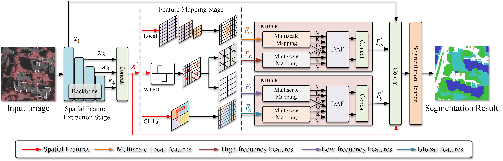

## SFFNet: A Wavelet-Based Spatial and Frequency Domain Fusion Network for Remote Sensing Segmentation

[](https://doi.org/10.1109/tgrs.2024.3427370)
[](https://ieeexplore.ieee.org/document/10596303)
[](https://ieeexplore.ieee.org/stamp/stamp.jsp?tp=&arnumber=10596303)

------------------------------

## 📑 Table of Contents

- [📚 Introduction](#-introduction)
- [📖 Abstract](#-abstract)
- [🏗️ Architecture Diagram](#️-architecture-diagram)
- [📁 Project Structure](#-project-structure)
- [🚀 Quick Start](#-quick-start)
  - [1. Installation](#1installation)
  - [2. Prepare Dataset](#2prepare-dataset)
  - [3. Training](#3training)
  - [4. Evaluate on Vaihingen dataset](#4evaluate-on-vaihingen-dataset)
- [🙏 Acknowledgment](#acknowledgment)

-------------------------------

## 📚 Introduction

Official implementation of **SFFNet**, a novel dual-branch network that leverages wavelet transform for spatial and frequency domain fusion in remote sensing image segmentation.


--------------------
## 📖 Abstract

This paper propose SFFNet, a novel framework for remote sensing image segmentation that effectively fuses spatial and frequency domain information. It employs a two-stage design: spatial feature extraction followed by a dual-domain mapping stage. Key innovations include a Wavelet Transform Feature Decomposer (WTFD) for frequency analysis and a Multiscale Dual-representation Alignment Filter (MDAF) to bridge domain gaps, achieving state-of-the-art mIoU scores of 84.80% and 87.73% on benchmark datasets. 

-------------------------------

## 🏗️ Architecture Diagram


*The proposed two-stage spatial-frequency fusion framework of SFFNet.*

--------------------

## 📁 Project Structure

Prepare the following folders to organize this repo:

```plaintext
SFFNet-main/ [Remote Sensing Segmentation Framework]
├── data/                       # dataset
│   ├── LoveDA/                 
│   ├── potsdam/                
│   └── vaihingen/              
│
├── fig_results/                # Experimental results and visualization
│   ├── loveda/                 
│   ├── potsdam/                
│   └── vaihingen/              
│
├── GeoSeg/                     # Main source code package
│   ├── config/                 # Configuration files
│   └── geoseg/                 
│       ├── datasets/           # Data loading and preprocessing modules
│       ├── losses/             # Loss function implementations
│       └── models/             # Model architectures and components
│   ├── tools/                  # Execution scripts
│   ├── inference_huge_image.py # Large image inference script
│   ├── inference_uavid.py  
│   ├── loveda_test.py          
│   ├── potsdam_test.py         
│   ├── train_supervision.py    # Main training script
│   └── vaihingen_test.py       # Vaihingen evaluation script
│
├── lightning_logs/             # PyTorch Lightning training logs
│   ├── loveda/                 
│   ├── potsdam/                
│   └── vaihingen/              
│
├── model_weights/              # Trained model checkpoints
│   ├── loveda/                 
│   ├── potsdam/                
│   └── vaihingen/              
│
├── pretrain_weights/           # Pre-trained backbone weights
├── README.md                   
└── requirements.txt            # Python environment dependencies
```
-------------------
## 🚀 Quick Start
This guide will help you set up the environment and run a basic training example on the Vaihingen dataset.

### 1.Installation

#### Clone the repository

```bash
git clone https://github.com/your-username/SFFNet.git
cd SFFNet
```

#### Install dependencies
Create and activate virtual environment (optional)

You can use either **Conda**
```bash
conda create -n sffnet python=3.8
conda activate sffnet
```
or **python's built-in venv**
```bash
python -m venv sffnet
source sffnet/bin/activate  # Linux/Mac
# sffnet\Scripts\activate  # Windows
```

Install dependencies
```bash
pip install -r requirements.txt
```
To install and use the wavelet analysis tools, see the official [pytorch_wavelets](https://github.com/fbcotter/pytorch_wavelets) documentation.

### 2.Prepare Dataset

#### ISPRS 2D Semantic Labeling Contest

- **Potsdam & Vaihingen**: Download the original datasets from the official website: [[Click Here](https://www.isprs.org/resources/datasets/benchmarks/UrbanSemLab/default.aspx)]
- **Preprocessed Vaihingen**: We provide the preprocessed Vaihingen dataset for direct use: [[Click Here](https://huggingface.co/datasets/yangys123333/RS_Image_Segmentation_Vaihingen/tree/main)]
- If you need to handle the dataset yourself, you can refer to this project:
 [GeoSeg](https://github.com/WangLibo1995/GeoSeg?tab=readme-ov-file)

#### Processed Vaihingen Dataset Structure
```plaintext
vaihingen/
├── test/                          # Test set directory
│   ├── images_1024/               # Test images
│   ├── masks_1024/                # Test ground truth labels (single-channel)
│   └── masks_1024_rgb/            # Visualized labels (colorful, for human viewing)
└── train/                         # Training set directory
    ├── images_1024/               # Training images
    └── masks_1024/                # Training ground truth labels (single-channel)
```
### 3.Training
To train the model on the Vaihingen dataset, run:
```bash
python GeoSeg/train_supervision.py -c GeoSeg/config/vaihingen/sffnet.py
```

#### ⚙️ Parameter Explanation

| Parameter | Type | Default | Description | Required |
|:----------|:----:|:-------:|:------------|:---------|
| `-c` | string | required | Configuration file path | ✅        |

You can create your own configuration file by using the template at `GeoSeg/config/vaihingen/sffnet.py` as a reference.


### 4.Evaluate on Vaihingen dataset

This script (`GeoSeg/{dataset}_test.py`) is used for evaluating trained segmentation models on test datasets with support for test-time augmentation (TTA).

#### Examples

```bash
python GeoSeg/vaihingen_test.py -c GeoSeg/config/vaihingen/sffnet.py -o fig_result/vaihingen -t --rgb
```

#### ⚙️ Evaluation Script Parameters

| Parameter | Short | Type | Default | Description | Required |
|:----------|:-----:|:----:|:-------:|:------------|:---------|
| `--config_path` | `-c` | string | None | Path to the configuration file | ✅ |
| `--output_path` | `-o` | string | None | Directory to save prediction masks | ✅ |
| `--tta` | `-t` | string | None | Test-time augmentation: `lr` (flips) or `d4` (flips+rotate+scale) | ❌ |
| `--rgb` | (None) | boolean | False | Output colorized RGB masks for visualization | ❌ |
-------------------------
## 🙏Acknowledgment

This repository is developed based on and extends the [GeoSeg](https://github.com/WangLibo1995/GeoSeg) framework. We gratefully acknowledge the contributions from the following open-source projects that form the foundation of our work:

- **[pytorch lightning](https://www.pytorchlightning.ai/)** - For scalable and reproducible deep learning training
- **[timm](https://github.com/rwightman/pytorch-image-models)** - For pre-trained backbone models and optimization techniques
- **[pytorch-toolbelt](https://github.com/BloodAxe/pytorch-toolbelt)** - For additional deep learning utilities and tools
- **[ttach](https://github.com/qubvel/ttach)** - For test-time augmentation capabilities
- **[catalyst](https://github.com/catalyst-team/catalyst)** - For high-level PyTorch utilities and training patterns
- **[mmsegmentation](https://github.com/open-mmlab/mmsegmentation)** - For semantic segmentation architectures and benchmarks
- **[pytorch_wavelets](https://github.com/fbcotter/pytorch_wavelets)** - For wavelet transform operations and frequency domain analysis

We extend our sincere appreciation to all the original authors and contributors of these projects for their valuable work.

--------------------------------------